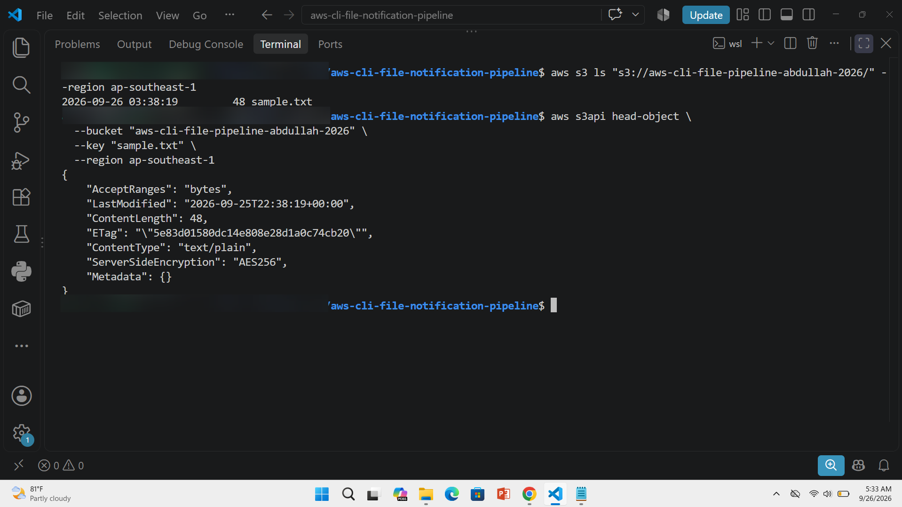
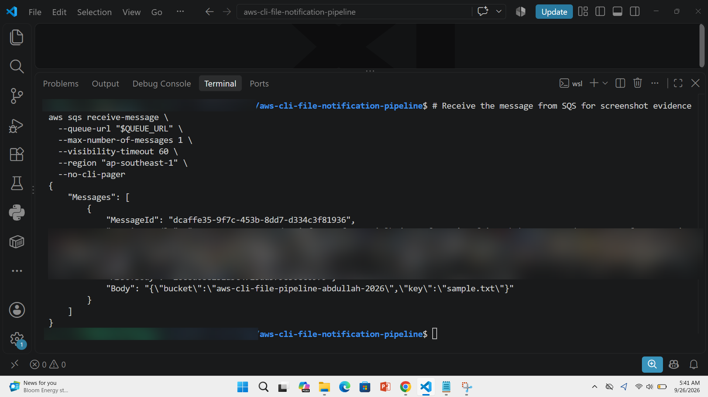
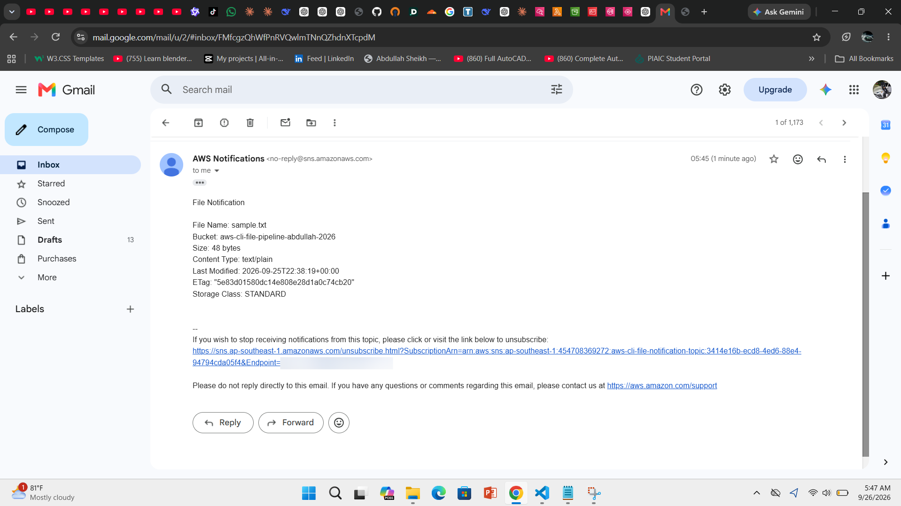
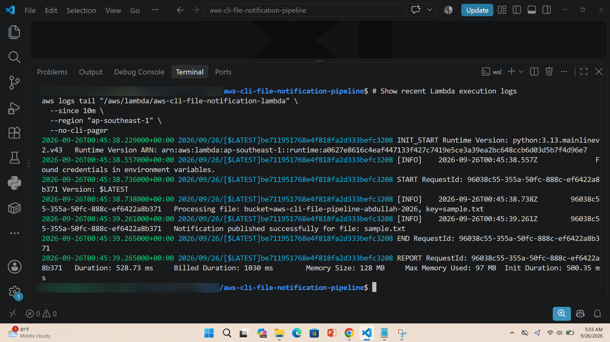
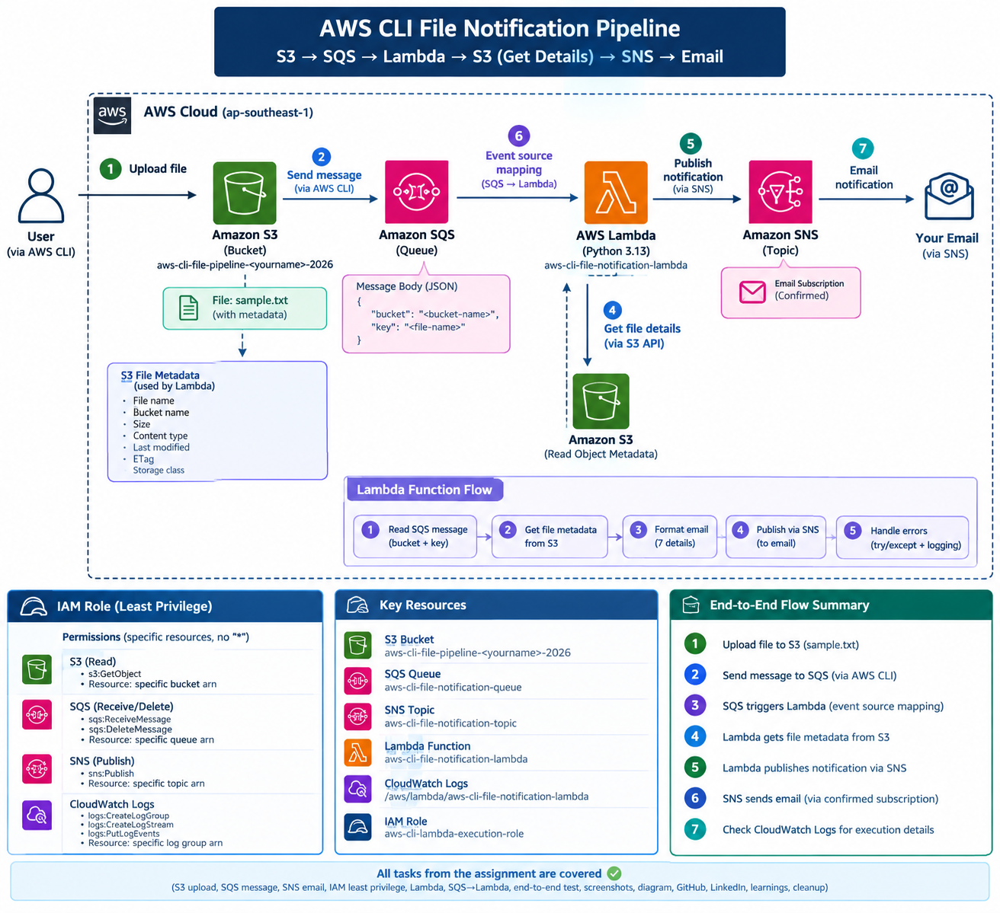

# AWS CLI Event-Driven File Notification Pipeline

## Project Overview

This project implements a serverless event-driven file notification pipeline using AWS CLI.

The pipeline processes an uploaded file from Amazon S3, sends the file details to Amazon SQS, processes the message with AWS Lambda, retrieves file metadata from S3, publishes the details through Amazon SNS, and delivers the notification to an email address.

All AWS resources were created and configured using AWS CLI.

## Architecture

S3 Upload → AWS CLI → SQS Queue → Lambda Function → S3 Metadata → SNS Topic → Email Notification

Lambda Function → CloudWatch Logs

## AWS Services Used

- Amazon S3
- Amazon SQS
- AWS Lambda
- Amazon SNS
- Amazon CloudWatch Logs
- AWS IAM
- AWS CLI

## Project Flow

1. Upload a sample file to Amazon S3.
2. Send the bucket name and file name to Amazon SQS as a JSON message.
3. Create an Amazon SNS topic and subscribe an email address.
4. Confirm the SNS email subscription.
5. Create an IAM role for Lambda using least-privilege permissions.
6. Lambda reads the SQS message.
7. Lambda retrieves file metadata from S3 using `head_object`.
8. Lambda publishes the file details to SNS.
9. SNS sends the notification to the confirmed email address.
10. Lambda execution details are available in CloudWatch Logs.

## Project Structure

- commands/01-s3.sh - Create S3 bucket and upload sample file
- commands/02-sqs.sh - Create SQS queue and send file message
- commands/03-sns.sh - Create SNS topic and email subscription
- commands/04-iam.sh - Create Lambda IAM role and permissions
- commands/05-lambda.sh - Create Lambda function
- commands/06-event-source.sh - Connect SQS to Lambda
- commands/07-test.sh - Test the complete pipeline
- commands/08-cleanup.sh - Remove AWS resources
- lambda/lambda_function.py - Lambda application code
- iam/lambda-trust-policy.json - Lambda trust policy
- iam/lambda-permissions-policy.json - Least-privilege permissions reference
- sample.txt - Sample file used for testing

## Deployment

Run the scripts in the following order.

### 1. S3

```bash
bash commands/01-s3.sh
```

Creates the S3 bucket, creates the sample file, uploads it to S3, and verifies the object.

### 2. SQS

Run:

```bash
bash commands/02-sqs.sh
```

Creates the SQS queue and sends the file details message.

Message format:

{"bucket":"<bucket-name>","key":"<file-name>"}

### 3. SNS

Run:

```bash
bash commands/03-sns.sh
```

Before running the script, replace YOUR_EMAIL@example.com with your email address.

After subscribing, confirm the SNS subscription from the email received.

### 4. IAM

Run:

```bash
bash commands/04-iam.sh
```

Creates the Lambda IAM role with least-privilege permissions for S3, SQS, SNS, and CloudWatch Logs.

No Resource: "*" permission is used.

### 5. Lambda

Run:

```bash
bash commands/05-lambda.sh
```

Creates the Lambda deployment package and Lambda function.

The Lambda function reads the SQS message and retrieves S3 object metadata using head_object.

### 6. SQS to Lambda

Run:

```bash
bash commands/06-event-source.sh
```

Creates the event source mapping between SQS and Lambda.

### 7. Test

Run:

```bash
bash commands/07-test.sh
```

Sends a test message to SQS and checks Lambda processing and CloudWatch Logs.

## Lambda Processing

The Lambda function:

1. Reads the SQS message.
2. Parses the JSON message.
3. Extracts the S3 bucket and object key.
4. Calls S3 head_object.
5. Reads the file metadata.
6. Builds the notification message.
7. Publishes the notification to SNS.
8. Logs successful processing.
9. Logs errors when processing fails.

## File Metadata

The notification includes:

- File Name
- Bucket
- Size
- Content Type
- Last Modified
- ETag
- Storage Class

## IAM Least Privilege

The Lambda role is restricted to the required resources.

S3:

- s3:GetObject

SQS:

- sqs:ReceiveMessage
- sqs:DeleteMessage
- sqs:GetQueueAttributes

SNS:

- sns:Publish

CloudWatch Logs:

- logs:CreateLogStream
- logs:PutLogEvents

The repository policy file contains placeholders for environment-specific ARNs. The deployment script generates the actual ARNs dynamically.

## Testing

The end-to-end pipeline was tested successfully.

The test confirmed:

- S3 object exists.
- SQS message is processed.
- Lambda retrieves S3 metadata.
- SNS notification is published.
- Email notification is received.
- Lambda execution appears in CloudWatch Logs.

## CloudWatch Logs

View Lambda logs with:

```bash
aws logs tail "/aws/lambda/aws-cli-file-notification-lambda" --since 10m --region ap-southeast-1
```

## Screenshots


### S3 File



### SQS Message



### Email Received



### CloudWatch Logs



Sensitive information such as AWS account IDs, ARNs, email addresses, access keys, and credentials should be blurred or removed from screenshots.

## Architecture Diagram



S3 Upload → AWS CLI → SQS → Lambda → S3 Metadata → SNS → Email

Lambda → CloudWatch Logs

## Learnings

- Learned how to build a serverless event-driven workflow using AWS CLI.
- Learned how S3, SQS, Lambda, SNS, IAM, and CloudWatch work together.
- Learned how to implement least-privilege IAM permissions.

## Challenges

- Creating IAM permissions with specific resource ARNs required careful policy configuration.
- Configuring SQS to Lambda event source mapping and verifying asynchronous processing required CloudWatch log validation.

## Cleanup

After completing all screenshots, GitHub submission, and LinkedIn documentation, run:

```bash
bash commands/08-cleanup.sh
```

The cleanup script removes the Lambda event source mapping, Lambda function, IAM role and policy, CloudWatch log group, SNS topic, SQS queue, S3 object, and S3 bucket.

Do not run the cleanup script until all assignment evidence has been collected.

## Security

Never commit:

- AWS access keys
- AWS secret keys
- Passwords
- Personal email addresses
- Credentials
- Sensitive account information

The repository uses .gitignore to exclude deployment ZIP files, Python cache files, environment files, and AWS credential directories.
